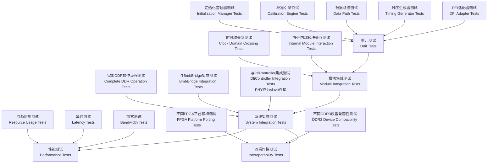

## Context

SpinalHDL已具备完整的DFI基础设施，包括DFI接口定义、控制器和配置系统位于`lib/src/main/scala/spinal/lib/memory/sdram/dfi/`目录下。现有的DDR3 PHY实现在`tester/src/test/scala/spinal/demo/phy/`目录中仅作为参考实现。为了提供给用户一个可直接使用的、生产级别的DFI接口多标准DDR PHY组件，需要基于现有代码进行增强，支持多DDR标准（DDR2、DDR3、DDR4、LPDDR系列），确保完全兼容DFI 3.1规范，参考LiteX USPHY实现和现有demo代码的设计思路。

## Goals / Non-Goals

### Goals
- 在主库中创建全新的多DDR标准PHY组件（DDR2/3/4，LPDDR2/3/4）
- 完全兼容DFI 3.1规范，支持所有必需接口组
- 参考LiteX USPHY实现和现有demo代码进行架构设计
- 与现有DFI基础设施无缝集成
- 提供灵活的配置接口适应不同应用场景
- 确保高性能和低资源开销

### Non-Goals
- 不重新实现底层DFI协议（已有基础设施）
- 不包含特定FPGA厂商的优化（保持通用性）
- 不提供图形界面配置工具（专注API接口）
- 不支持非JEDEC标准DDR内存类型

## Decisions

### PHY架构选择
**Decision**: 采用模块化分层设计，参考LiteX USPHY架构和现有demo代码设计思路，在主库中创建全新的实现
- **DFI适配器层**: 处理DFI 3.1协议到内部命令的转换，支持所有必需接口组
- **标准适配层**: 根据配置的DDR标准（DDR2/3/4，LPDDR2/3/4）适配相应的JEDEC规范
- **时序生成器**: 产生符合目标DDR标准的控制信号和时序参数
- **数据路径**: 处理读写数据的格式转换、时序对齐和标准特定的数据处理
- **校准引擎**: 实现各DDR标准的训练和校准功能（写电平、读校准、CA训练等）
- **初始化管理器**: 处理多标准DDR初始化和模式寄存器配置

**Rationale**: 分层模块化设计提高可维护性、可扩展性和标准兼容性，便于单独测试和优化各功能块，同时支持多DDR标准的灵活配置，参考现有demo代码和LiteX USPHY实现。

**Alternatives considered**:
- 单体设计：优点是接口简单，但缺点是难以测试和维护
- 高度参数化的宏设计：优点是灵活性高，但缺点是编译时间长且难以调试
- 标准特定设计：优点是优化程度高，但缺点是缺乏灵活性

### 时钟域管理
**Decision**: 增强现有时钟管理，支持DFI 3.1规范的多种频率比配置（1:1, 1:2, 1:4），优化现有异步FIFO进行跨时钟域通信

**Rationale**: 不同DDR标准和应用场景需要不同的PHY:MC频率比，DFI 3.1规范要求PHY能够接受任何相位的命令，基于现有成熟的时钟管理架构进行增强。

**Alternatives considered**:
- 固定频率比：过于刚性，无法适应不同应用需求
- 动态频率切换：实现复杂，且收益有限

### 初始化和校准策略
**Decision**: 增强现有`Initialize`状态机，支持多DDR标准的JEDEC初始化流程，包括写电平、读校准和CA训练

**Rationale**: 不同DDR标准需要不同的初始化序列，增强现有成熟的初始化逻辑可以简化用户设计并确保兼容性。

**Alternatives considered**:
- 外部初始化控制器：增加系统复杂度
- 简化初始化：不支持完整DDR3功能集

### 配置接口设计
**Decision**: 扩展现有配置结构，采用增强的参数化配置类，支持多DDR标准选择和DFI 3.1功能配置

**Rationale**: 不同应用需要不同的DDR标准和DFI 3.1功能配置，基于现有配置接口进行扩展可以提高组件复用性并保持向后兼容性。

**Alternatives considered**:
- 硬编码配置：缺乏灵活性
- 完全运行时配置：增加资源开销

## PHY Architecture Diagram

```mermaid
graph TB
    subgraph "DfiController (MC)"
        DFI_CTRL[DfiController<br/>dfi = master(Dfi)]
    end

    subgraph "DFI 3.1 Interface"
        DFI_IF[DFI Interface<br/>DfiController.dfi <> DfiDdrPhy.dfi]
    end

    subgraph "DfiDdrPhy (PHY)"
        DFI_SLAVE[DFI Slave Interface<br/>dfi = slave(Dfi)]
        DFI_ADAPT[DFI 3.1 Adapter]
    end

    subgraph "Standard Adaptation Layer"
        STD_ADAPT[DDR Standard Adapter]
        JEDEC_CONFIG[JEDEC Config Manager]
    end

    subgraph "PHY Core"
        INIT_MGR[Initialization Manager]
        TIMING_GEN[Timing Generator]
        DATA_PATH[Data Path Handler]
        CAL_ENGINE[Calibration Engine]
        FREQ_MGR[Frequency Manager]
    end

    subgraph "DDR Interface"
        DDR_IO[DDR I/O Signals<br/>master(DdrIO)]
        CLK_MGMT[Clock Management]
    end

    DFI_CTRL --> DFI_IF
    DFI_IF --> DFI_SLAVE
    DFI_SLAVE --> DFI_ADAPT
    DFI_ADAPT --> STD_ADAPT
    STD_ADAPT --> JEDEC_CONFIG
    JEDEC_CONFIG --> INIT_MGR
    JEDEC_CONFIG --> TIMING_GEN
    JEDEC_CONFIG --> DATA_PATH

    INIT_MGR --> TIMING_GEN
    TIMING_GEN --> DDR_IO
    DATA_PATH --> DDR_IO
    CAL_ENGINE --> TIMING_GEN
    CAL_ENGINE --> DATA_PATH
    FREQ_MGR --> TIMING_GEN
    FREQ_MGR --> DDR_IO

    CLK_MGMT --> TIMING_GEN
    CLK_MGMT --> DDR_IO
```

## PHY Interface Design

### Main Component Interface

```scala
case class DfiDdrPhy(config: DfiDdrPhyConfig) extends Component {
   val io = new Bundle {
     // DFI接口 - 作为DfiController的slave，接收DFI信号
     val dfi = slave(Dfi(config.dfiConfig))

     // DDR接口 - 作为DDR设备的master，驱动DDR信号
     val ddr = master(DdrIO(config.ddrConfig))

     // 时钟和复位
     val clocks = in(DfiDdrPhyClocks())
     val reset = in Bool()

     // 控制和状态
     val initDone = out Bool()
     val trainingStatus = out(DfiDdrPhyStatus())
   }
 }
```

### Configuration Classes

```scala
// 新的多标准PHY配置类
case class DfiDdrPhyConfig(
     dfiConfig: DfiConfig,           // DFI接口配置
     ddrConfig: DdrConfig,           // 多标准DDR设备配置
     timingConfig: DdrTimingConfig, // 多标准时序参数
     calibrationConfig: CalibrationConfig, // 校准配置
     dfi31Config: Dfi31Config        // DFI 3.1特定配置
 )

// 多标准DDR配置
case class DdrConfig(
     standard: DdrStandard,          // DDR标准类型（DDR2/DDR3/DDR4/LPDDR2/LPDDR3/LPDDR4）
     generation: DdrGeneration,      // 设备型号
     chipCount: Int,                 // 芯片数量（rank）
     dataWidth: Int,                 // 数据宽度
     frequencyMHz: Int,              // 工作频率
     chipSelectWidth: Int            // 芯片选择宽度
 )

// DFI 3.1特定配置
case class Dfi31Config(
     frequencyRatio: FrequencyRatio,  // 频率比（1:1, 1:2, 1:4）
     enableTraining: Boolean,        // 启用训练功能
     enableDbI: Boolean,             // 启用DBI功能
     enableCrc: Boolean,             // 启用CRC功能
     enableCaParity: Boolean         // 启用CA奇偶校验
 )
```

## Test and Verification Strategy

### 测试层次结构



### 测试覆盖目标

#### 功能测试
- **DDR3基本操作**: 读写 burst、不同地址模式、字节掩码
- **初始化流程**: JEDEC标准初始化序列、模式寄存器配置
- **校准功能**: 写电平校准、读校准、门控训练
- **错误处理**: 命令冲突、时序违规、数据错误检测

#### 时序测试
- **建立/保持时间**: 所有信号的时序约束验证
- **时钟域边界**: 跨时钟域信号的正确传输
- **频率比测试**: 不同PHY:MC频率比的正确操作

#### 性能测试
- **最大带宽**: 理论最大读写带宽的实现
- **延迟测量**: 从命令发起到数据返回的延迟
- **资源效率**: FPGA资源使用优化

#### 兼容性测试
- **设备兼容性**: 不同DDR标准设备型号的支持
- **控制器兼容性**: 与`DfiController`的dfi接口互操作性
- **平台兼容性**: 不同FPGA架构的移植性

### 验证方法

#### 仿真验证
- **RTL仿真**: 使用Verilator/VCS进行周期精确仿真
- **门级仿真**: 综合后时序仿真验证
- **形式验证**: 关键协议属性的形式化验证

#### 硬件验证
- **FPGA原型验证**: 在目标FPGA上进行硬件测试
- **芯片测试**: 使用实际DDR3设备进行测试
- **性能基准**: 与商业PHY进行性能对比

#### 自动化测试
- **回归测试套件**: 自动化测试脚本和持续集成
- **压力测试**: 长运行时间和边界条件测试
- **随机测试**: 随机激励生成和覆盖率驱动测试

### 测试环境和工具

#### 软件工具
- **仿真器**: Verilator, VCS, XSim, GHDL, IVerilog
- **综合工具**: Vivado, Quartus, ISE
- **测试框架**: SpinalHDL测试器，Cocotb
- **覆盖率工具**: 代码覆盖率和功能覆盖率分析

#### 测试平台
- **仿真模型**: DDR3设备行为模型
- **总线功能模型**: BMB/AHB/AXI总线模型
- **监控器**: 协议检查器和性能监视器

### 质量指标

#### 功能质量
- **功能覆盖率**: >95%的功能覆盖率
- **代码覆盖率**: >90%的代码覆盖率
- **错误注入**: 所有错误场景的处理验证

#### 性能质量
- **时序收敛**: 所有时序约束满足
- **资源效率**: 与商业PHY相当或更好的资源使用
- **功耗优化**: 合理的功耗特性

#### 可靠性质量
- **稳定性**: 长时间运行无错误
- **鲁棒性**: 异常条件下的正确恢复
- **可维护性**: 清晰的代码结构和文档

## Risks / Trade-offs

### 新实现风险
- **Risk**: 在主库中创建全新的实现可能与现有DFI基础设施不完全兼容
- **Mitigation**: 全面分析现有DFI接口，严格遵循DFI 3.1规范，确保接口一致性

### 多标准复杂性
- **Risk**: 支持多DDR标准可能导致配置复杂度和代码复杂度增加
- **Mitigation**: 采用清晰的标准适配层架构，提供预定义配置模板和示例

### DFI 3.1合规性风险
- **Risk**: 完全实现DFI 3.1规范的所有接口组可能过于复杂
- **Mitigation**: 分阶段实现，先实现核心接口组，再添加高级功能

### 性能 vs. 资源使用
- **Risk**: 多标准支持可能导致资源使用增加
- **Mitigation**: 采用模块化设计和条件编译，提供不同优化级别的实现选项

## Migration Plan

### 基于参考实现的开发策略
1. **分析现有实现**: 深入分析demo代码（`DfiPhyDdr3.scala`、`Initialize.scala`、`ddr3_dfi_phy.v`）的设计思路和架构模式
2. **提取核心模式**: 识别可复用的架构模式、状态机设计和数据流处理
3. **设计新实现**: 基于提取的模式，在主库中创建全新的生产级别实现
4. **参考LiteX USPHY**: 参考usphy.py实现进行架构优化和最佳实践
5. **确保DFI 3.1合规性**: 实现完整的DFI 3.1接口组和功能

### 用户使用指南
- 新PHY组件提供在主库中，用户可以直接与DfiController连接使用
- 参考demo代码的使用模式，但使用新的标准化实现
- 提供详细的配置和使用文档
- 包含完整的工作示例，展示如何与DfiController集成

## Open Questions

- 如何设计DFI适配器以正确处理DfiController的dfi接口信号？
- 如何实现PHY作为slave接收DfiController的master接口？
- 如何设计标准适配层以支持不同DDR标准的JEDEC规范？
- 如何实现DFI 3.1的完整接口组（控制、数据、状态、训练、低功耗、错误）？
- 如何平衡多标准支持与代码复杂性之间的关系？
- 如何设计配置接口以支持不同DDR标准的参数管理？

## Dependencies

- 依赖现有的DFI基础设施（`spinal.lib.memory.sdram.dfi.*`）
- 参考现有demo代码（`DfiPhyDdr3.scala`、`Initialize.scala`、`ddr3_dfi_phy.v`）的设计思路
- 需要与`DfiController`的dfi接口正确连接（PHY作为slave）
- 需要与`BmbBridge`的互操作性验证
- 需要扩展配置系统以支持多DDR标准和DFI 3.1功能
- 参考LiteX USPHY实现进行架构优化