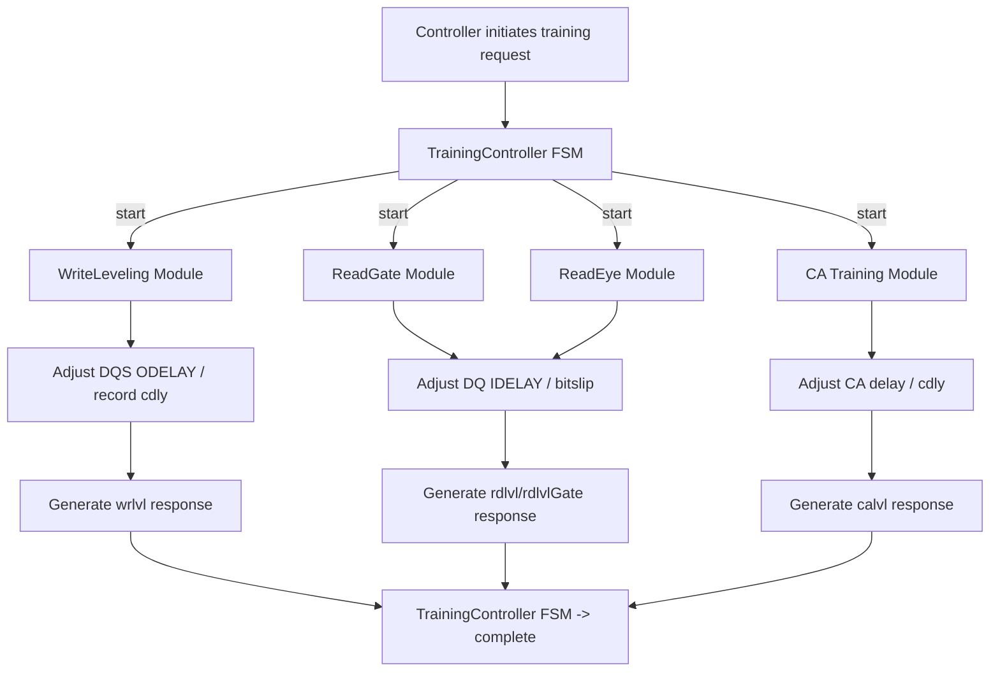

# Design: Training Algorithms and Timing Decisions (align-xilinxusphy-to-litex-usphy)

## Objectives
- Record design decisions and trade-offs regarding training algorithms, timing biases, and delay element usage when aligning the Scala implementation [`lib/src/main/scala/spinal/lib/memory/sdram/dfi/phy/XilinxUSPhy.scala`](lib/src/main/scala/spinal/lib/memory/sdram/dfi/phy/XilinxUSPhy.scala:1) to the LiteX reference implementation [`usphy.py`](usphy.py:1).

## References
- LiteX reference implementation: [`usphy.py`](usphy.py:1)
- Current Scala source: [`lib/src/main/scala/spinal/lib/memory/sdram/dfi/phy/XilinxUSPhy.scala`](lib/src/main/scala/spinal/lib/memory/sdram/dfi/phy/XilinxUSPhy.scala:1)
- This proposal and tasks: [`openspec/changes/align-xilinxusphy-to-litex-usphy/proposal.md`](openspec/changes/align-xilinxusphy-to-litex-usphy/proposal.md:1) and [`openspec/changes/align-xilinxusphy-to-litex-usphy/tasks.md`](openspec/changes/align-xilinxusphy-to-litex-usphy/tasks.md:1)

## High-Level Design Constraints
- Prioritize implementing minimal viable changes to fix functional differences and simulation/synthesis warnings, then gradually improve training algorithm details.
- Maintain configurability and fallback: All important changes to initial delay/decision thresholds should be parameterized (overridable by CSR or constructor parameters) to enable fallback verification on FPGA boards.
- Simulation-friendly: BlackBox wrapper retains simulation-friendly defaults (e.g., IDELAYCTRL.RDY = True) and documented to avoid misleading.

## Key Design Points (Item by Item)

### 1) DQS Initial Offset (tck/4)
- LiteX uses p_DELAY_VALUE = int(tck*1e12/4) on DQS's ODELAYE3 (see [`usphy.py`](usphy.py:276)).
- Decision:
  - Set the default delayValue for DQS's corresponding ODELAYE3 in Scala to approximately tck/4 (select adjustable default value in implementation, e.g., 125 ps as example), and expose this value as a constant/parameter for adjustment.
  - Rationale: Helps reduce training initial search space and accelerates write-leveling/read-leveling convergence.
  - Risk: tck/4 values differ on different frequency platforms, so must be parameterized and adjustable at runtime.

### 2) ODELAY/IDELAY Driving and CNTVALUEIN
- LiteX explicitly uses CNTVALUEOUT/CNTVALUEIN in instantiation (with p_DELAY_VALUE initial values in some places).
- Decision:
  - Explicitly drive CNTVALUEIN (default 0) and DATAIN/IDATAIN (read path) on all ODELAYE3/IDELAYE3 instances to eliminate simulation "NO DRIVER" warnings.
  - Rationale: Prevent simulation backends from failing due to unconnected ports; on real FPGA, CNTVALUEIN is usually driven by control logic or training, default values in simulation can replace hardware calibration.
  - Risks and mitigations: Simulation defaults may mask real calibration issues; mitigation is to document differences in documentation and wrapper, and provide real IDELAYCTRL stub drivers when necessary.

### 3) ISERDESE3 FIFO_RD_CLK and FIFO_RD_EN
- LiteX/hardware requires FIFO_RD_CLK to be provided when FIFO mode is enabled.
- Decision:
  - Connect serdes.FIFO_RD_CLK to sysClk (CLKDIV) in Scala and bind FIFO_RD_EN to dqsGate/dqs gating control signal.
  - Rationale: Ensure complete simulation and timing behavior, avoid "NO DRIVER" and synchronization errors.
  - Parameterization: Provide configurable interface if different FIFO clock domains need to be supported.

### 4) rddata_valid Generation Strategy
- LiteX uses a tap delay line (read_latency) to generate rddata_valid (see [`usphy.py`](usphy.py:446-452)).
- Decision:
  - Scala maintains equivalent behavior but uses History/RegNext implementation for better timing closure; ensure configParams.read_latency is consistent with LiteX calculation (cl_sys_latency + 5).
  - Validation: Add unit tests to verify relative offset of rddata_valid under different cl/cwl/cmd_latency combinations.

### 5) Initialization Phase (MRS / ZQ)
- LiteX explicitly overrides pad outputs through initCmd/initCsN/initCke during init and writes MR2/MR3/MR1/MR0 according to MRS sequence.
- Decision:
  - Ensure Scala's initManager's generated initCsN/initCke/initCmd override logic has highest priority in cmdGen pipeline (existing implementation needs verification that init override is effective at all pipeline stages).
  - Add test cases: Capture CS/CKE/resetN waveforms on pads during init phase in simulation and compare with LiteX reference.

### 6) Training Algorithms (Write leveling / Read gate / Read eye / CA)
- Observation: Some training modules in Scala contain "placeholder" sampling (directly assigning receivedPattern := expectedPattern), need to replace with real sampling chains.
- Design goals:
  - Training modules should use real sampling data chains:
    - Write leveling: Read samples from DQ's ISERDESE3 or delayed samples at strobe time, perform matching statistics.
    - Read gate/eye: Read four-phase data from ISERDESE3 parallel outputs (or multiple phase samples), execute sliding-window determination and window stability counting.
    - CA training: Read from CA pins (cmd/address bank) through sampling paths and compare with expected patterns.
  - Initial decision threshold values aligned with LiteX (e.g., consecutive valid sample counts, window length), and parameterized as CSR adjustable.
- Implementation details:
  - Connect training's receivedData to sampling points of deserialized outputs in dataPath (may need to export corresponding signals to training module or pass through internal bus).
  - Bitslip/Delay increment control issued centrally by TrainingController to ensure single drive source.
- Validation:
  - Run typical training scripts (write-leveling, read-gate, read-eye, CA) in simulation, check training status and DFI response signals.

### 7) BlackBox Wrapper and Simulation Stubs
- Design decisions:
  - Maintain simulation-friendly presets in `lib/src/main/scala/spinal/lib/blackbox/xilinx/ultrascale/IO.scala` (e.g., IDELAYCTRL.RDY := True), but clearly note in comments that this is for simulation convenience behavior, not representing hardware calibration process.
  - Provide a set of primitive stubs (`OSERDESE3.v`, `ISERDESE3.v`, `ODELAYE3.v`, `IDELAYE3.v`, `IOBUF.v`, etc.) in `tester/src/test/python/spinal/XilinxUSPhyTester/` to enable Verilator/IVerilog/GHDL backends to successfully compile and run.
  - Stub behavior should be functionally consistent with LiteX simulation assumptions (e.g., OSERDESE3 outputs serialized bits and can drive ODATAOUT, ODELAY/IDELAY support simple cntvalue read/write semantics).
- Risks and mitigations:
  - If stubs are oversimplified, may mask hardware issues; mitigation: document simplification points in stubs and maintain parameterization in design to replace with real primitives.

### 8) Parameterization and Fallback
- All key values (DQS initial delay, training decision thresholds, CNTVALUE defaults, FIFO clock selection) must be configurable:
  - Default values target common DDR3 @200MHz platforms (e.g., tck/4 ~ 125 ps), but can be overridden via constructor parameters or CSR.
  - Clearly mark default values in PR and provide adjustment suggestions in documentation.

## Validation Plan (Brief)
### Unit/Simulation Validation:
- Fix blackbox and stubs to enable sbt test to run Verilator/GHDL/IVerilog.
- Run init/command timing/read/write data-integrity/basic training test sets to confirm behavior matches LiteX reference implementation (timing offsets within acceptable range).

### Hardware Regression:
- Run key initialization and simple read/write scenarios on target FPGA boards (to be conducted separately as subsequent steps).

## Appendix: Mermaid (Training Phase Flow)

## Conclusion
- This design document records key training and timing decisions and parameterization strategies during the alignment process. Next steps follow the order in `tasks.md` for implementation and simulation verification and documentation updates at each milestone.