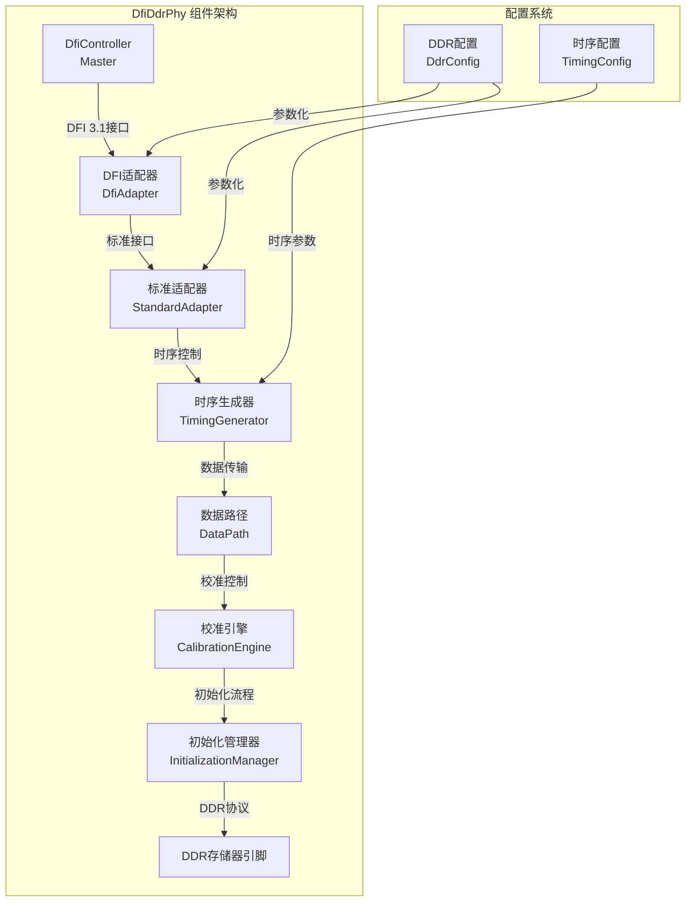

## Context

SpinalHDL目前缺少标准化的DFI接口DDR PHY组件。虽然在tester模块中存在demo实现，但缺乏生产就绪的标准化PHY组件来与现有的DfiController集成。本设计旨在创建一个多标准、DFI 3.1兼容的DDR PHY组件，作为DfiController的slave组件工作。

## Goals / Non-Goals

### Goals
- **标准化PHY组件**: 创建可在生产环境中使用的标准化DFI DDR PHY
- **多标准支持**: 支持DDR2、DDR3、DDR4、LPDDR2、LPDDR3、LPDDR4
- **DFI 3.1兼容**: 完整实现DFI 3.1规范的所有接口组
- **与DfiController集成**: 无缝连接到现有的DfiController组件
- **LiteX兼容性**: 参考成熟的LiteX USPHY架构确保可靠性

### Non-Goals
- **不修改现有DfiController**: 保持现有DfiController的完整性
- **不破坏向后兼容性**: 确保与现有DFI基础设施的互操作性
- **不包括硬件特定优化**: 保持FPGA无关的设计
- **不包括综合优化**: 专注于功能正确性和架构清晰性

## Decisions

### 1. PHY角色定位
**Decision**: PHY作为DfiController的slave组件，接收DFI信号
- **Rationale**: 符合DFI 3.1规范的典型应用模式，DfiController作为master控制PHY
- **Alternatives considered**:
  - PHY作为独立组件：不符合DFI规范，增加集成复杂度
  - 双向DFI接口：过度复杂，不必要的功能

### 2. 多标准支持策略
**Decision**: 通过配置类实现多标准支持，而不是多个独立组件
- **Rationale**: 减少代码重复，提高可维护性，支持运行时标准切换
- **Alternatives considered**:
  - 独立的标准特定组件：增加维护负担
  - 模板化设计：增加编译复杂度

### 3. 架构分层设计
**Decision**: 采用六层模块化架构，参考LiteX USPHY设计
- **Rationale**: 清晰的关注点分离，便于测试和维护
- **Alternatives considered**:
  - 单一大组件：难以测试和调试
  - 过细的模块划分：增加接口复杂度

### 4. 配置驱动设计
**Decision**: 使用Scala case class实现参数化配置
- **Rationale**: 类型安全，编译时验证，支持运行时配置
- **Alternatives considered**:
  - 字符串配置：缺乏类型安全
  - 注解驱动：SpinalHDL生态系统不匹配

### 5. DFI接口实现
**Decision**: 直接使用现有DFI接口定义，不创建包装器
- **Rationale**: 利用现有的DFI基础设施，减少重复代码
- **Alternatives considered**:
  - 创建新的DFI接口：破坏与现有系统的互操作性
  - 修改现有DFI接口：破坏向后兼容性

## Risks / Trade-offs

### 性能与灵活性的权衡
- **Risk**: 多标准支持可能影响单标准场景的性能优化
- **Mitigation**: 提供编译时标准选择和运行时参数配置
- **Trade-off**: 接受一定的资源开销以换取灵活性

### 复杂性管理
- **Risk**: 多层架构增加理解和调试难度
- **Mitigation**: 提供清晰的文档和调试接口
- **Trade-off**: 接受架构复杂性以换取模块化优势

### 与现有系统的集成
- **Risk**: 与现有DfiController的集成可能出现时序问题
- **Mitigation**: 严格遵循DFI 3.1时序规范，进行充分仿真验证
- **Trade-off**: 接受集成调试开销以确保正确性

## Migration Plan

### 无缝迁移路径
1. **现有用户**: 无需修改，继续使用现有DfiController
2. **新用户**: 可选择使用新的标准化PHY组件
3. **渐进式采用**: 支持与现有demo代码的互操作性

### 向后兼容性保证
- 保持所有现有API不变
- 新组件作为可选增强功能提供
- 提供迁移指南和示例代码

## Open Questions

### 技术细节待澄清
- **频率比支持的具体实现方式**: 需要详细分析DfiController的频率比实现
- **训练操作的精确时序要求**: 需要参考DDR标准规范确定具体参数
- **资源优化的具体策略**: 需要根据目标FPGA平台调整优化方向

### 集成细节待确定
- **与现有仿真环境的集成方式**: 需要分析现有测试框架
- **文档格式和详细程度的确定**: 需要了解用户文档偏好
- **示例代码的复杂度**: 需要平衡完整性和简洁性

## 架构图



## 模块职责

### DFI适配器 (DfiAdapter)
- 接收DfiController的DFI信号
- 解析DFI命令和数据
- 提供标准内部接口给其他模块

### 标准适配器 (StandardAdapter)
- 适配不同DDR标准的电气特性
- 处理标准特定的命令编码
- 管理电源状态转换

### 时序生成器 (TimingGenerator)
- 生成精确的DDR时序
- 处理频率比转换
- 管理命令时序约束

### 数据路径 (DataPath)
- 处理读写数据传输
- 实现DBI和CRC功能
- 管理数据总线时序

### 校准引擎 (CalibrationEngine)
- 执行读写校准操作
- 处理训练序列生成
- 管理校准状态机

### 初始化管理器 (InitializationManager)
- 执行DDR初始化序列
- 管理模式寄存器配置
- 处理复位和唤醒流程
```

## 关键接口定义

### DFI接口连接
```scala
// DfiController到PHY的连接
val dfiController = new DfiController(...)
val dfiPhy = new DfiDdrPhy(...)

// 连接DFI接口
dfiController.dfi <> dfiPhy.dfi
```

### 配置接口
```scala
// PHY配置示例
val phyConfig = DfiDdrPhyConfig(
  standard = DDR4,
  frequencyRatio = Ratio_1_2,
  features = DfiFeatures(
    dbi = true,
    crc = true,
    caParity = true
  )
)
```

## 测试策略

### 单元测试
- 每个模块的独立功能测试
- 配置参数验证
- 错误条件处理测试

### 集成测试
- 与DfiController的联合仿真
- 多标准切换测试
- 性能基准测试

### 系统级测试
- 完整DDR操作序列测试
- 训练操作验证
- 错误恢复测试